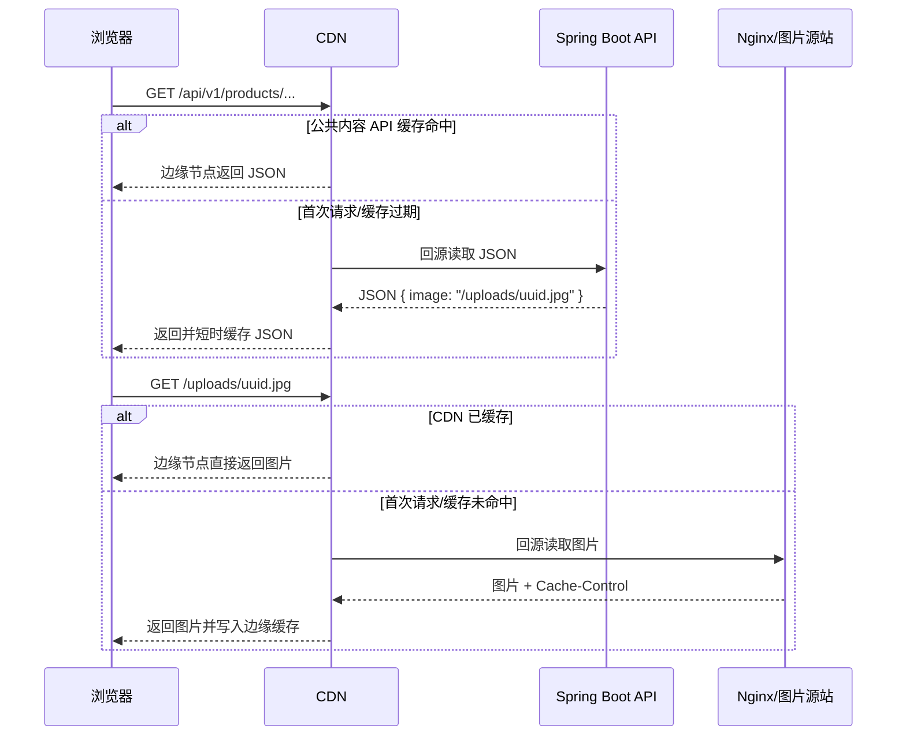

# 腾讯云海外独立站最低成本生产部署方案

> 适用对象：本项目的 Vue 3 前端、Spring Boot 3 后端与 MySQL 8；首期使用单台腾讯云 Lighthouse、Docker Compose、腾讯云 CDN、本地持久化上传图片与本机定时备份。**本阶段不使用 COS、TencentDB for MySQL。**
>
> 生产目标：以最低成本上线，优先保证海外可访问、HTTPS、数据库和上传图片不因容器重建丢失，以及具备可验证的本地备份。
>
> **HTTPS 由腾讯云 CDN 负责终止**，源站 Nginx 仅监听 HTTP 80 端口，不使用 Let's Encrypt 证书。

## 1. 本阶段架构与边界

```mermaid
flowchart LR
    V[海外访客] --> CDN[腾讯云 CDN\n全球边缘加速 / HTTPS]
    CDN --> S[腾讯云 Lighthouse\n新加坡 / Ubuntu 22.04]
    S --> G[Nginx Gateway\nHTTP 80]
    G --> F[Vue 静态前端容器]
    G --> B[Spring Boot 容器]
    G --> U[/opt/chemical/uploads]
    B --> M[(MySQL 8 容器\nDocker 内网)]
    M --> D[/opt/chemical/mysql-data\n宿主机持久化数据目录]
    M --> BK[/opt/chemical/backups\n每日数据库与图片备份]
    U --> BK
```

### 1.1 首期不包含的能力

- 不使用 COS：数据库和图片备份仅留在服务器本地，因此**不是异地灾备**。
- 不使用 TencentDB for MySQL：MySQL 数据写入宿主机持久化目录，容器故障或重建不会丢失数据，但单机磁盘/服务器故障时仍无法保证业务连续。
- CDN 缓存仅覆盖公开静态资源；后台、会话、上传、询盘与 API 请求始终回源，不得缓存。
- 不配置多可用区、自动扩缩容或零停机发布。

这些限制适合低成本首发，但要求运营者保留服务器快照，并定期把关键备份下载到离线受控位置。业务稳定后，优先升级为“COS 备份/图片托管”，再评估 TencentDB for MySQL。

## 2. 腾讯云购买与网络配置

### 2.1 推荐服务器规格

| 项目 | 首发推荐 | 原因 |
|---|---:|---|
| 产品 | 腾讯云 Lighthouse（海外区域） | 控制台和公网 IP 配置简单，适合单机 Docker 部署 |
| 区域 | 新加坡 | 适合目标市场未明确时的亚太均衡起点；后续由 CDN 覆盖全球 |
| 系统镜像 | Ubuntu 22.04 LTS 64 位 | Docker、Certbot 与安全更新成熟 |
| CPU / 内存 | **2 vCPU / 4 GiB** | 同机运行 Java、MySQL、Nginx 的最低稳妥规格 |
| 系统盘 | **80 GiB SSD 起** | 包含 MySQL、镜像、日志、上传文件与 14 天本地备份 |
| 流量 / 带宽 | 至少 5 Mbps，优先大流量包 | CDN 可降低静态内容的回源流量；未命中缓存、API 与后台仍会使用源站带宽 |
| 公网 IP | 固定 IP | CDN 回源地址需要长期稳定指向 |

不建议选择 1 GiB 或 2 GiB 内存：Spring Boot 与 MySQL 并行时容易触发 OOM。若首批产品图和新闻图较多，建议直接选择 100 GiB 磁盘或增加块存储。

### 2.2 防火墙与安全组

在 Lighthouse 防火墙中允许：

| 协议 | 端口 | 来源 | 用途 |
|---|---:|---|---|
| TCP | 80 | CDN 回源 IP 段 | HTTP；CDN 回源到源站 |
| TCP | 22 | 管理员固定公网 IP/32 | SSH；不要对全网开放 |

**不要开放** `3306`、`8080`、`5173`、`443`。数据库、后端与前端容器仅使用 Docker 内部网络，由 Nginx 对外暴露 80。HTTPS 在 CDN 层终止，源站不需要 443 端口。

### 2.3 域名解析

域名通过腾讯云 CDN 接入，DNS 记录由 CDN 提供 CNAME 值。部署前先在当前 DNS 服务商处将域名指向 CDN：

| 记录 | 主机记录 | 记录类型 | 记录值 | 说明 |
|---|---|---|---|---|
| CNAME | `www` | CNAME | CDN 提供的 CNAME 地址 | www 访问 |

CDN 回源使用源站的固定公网 IP。源站 Nginx 仅监听 HTTP 80 端口，HTTPS 由 CDN 托管证书并终止。

> **注意**：裸域名 `@` 记录无法使用 CNAME（DNS 规范限制）。如需裸域名访问，需在 CDN 控制台开启「裸域名加速」或使用 DNSPod 托管解析。

## 3. 本仓库提供的生产部署文件

| 文件 | 用途 |
|---|---|
| [Dockerfile.backend](Dockerfile.backend) | 用于 CI/CD 构建后端镜像并推送 GHCR（服务器首发不本地构建） |
| [Dockerfile.frontend](Dockerfile.frontend) | 用于 CI/CD 构建前端镜像并推送 GHCR（服务器首发不本地构建） |
| [docker-compose.prod.yml](docker-compose.prod.yml) | 从 GHCR 拉取后端/前端镜像，启动 MySQL 与公开 Nginx 网关 |
| [nginx/site.conf.template](nginx/site.conf.template) | HTTP、`/api/` 反代、`/uploads/` 静态文件与前端路由回退（HTTPS 由 CDN 终止） |
| [.env.production.example](.env.production.example) | 生产变量模板；复制为服务器 `.env` 后填写真实值 |
| [scripts/bootstrap-server.sh](scripts/bootstrap-server.sh) | 安装 Docker、创建部署用户、启用主机防火墙 |
| [scripts/deploy.sh](scripts/deploy.sh) | 拉取 GitHub `main`、登录 GHCR（可选）、拉取镜像、应用 SQL、启动服务、健康检查 |
| [scripts/backup-local.sh](scripts/backup-local.sh) | 每日备份 MySQL 与本地上传图片，清理过期备份 |

> `scripts/issue-certificate.sh` 和 `scripts/renew-certificate.sh` 已废弃。HTTPS 由腾讯云 CDN 托管证书，源站不需要 Let's Encrypt。

## 4. 首次部署步骤

以下命令都在 Ubuntu 服务器执行。示例中的 `example.com`、GitHub 地址、邮箱和部署用户必须替换为真实值。

### 4.1 服务器初始化

以 `root` 或具备 `sudo` 权限的用户登录。先将部署脚本从本地上传到服务器，或临时复制脚本内容执行；然后设置 SSH 公钥并初始化：

```bash
export DEPLOY_USER=deploy
export DEPLOY_DIR=/opt/chemical
export SSH_PUBLIC_KEY='ssh-ed25519 AAAA... your-key'
bash bootstrap-server.sh
```

脚本会安装 Docker Engine、Docker Compose 插件、Git、UFW、Fail2ban，创建 `deploy` 用户及以下持久化目录：

```text
/opt/chemical/app       Git 工作目录
/opt/chemical/uploads   后台上传图片，宿主机持久化
/opt/chemical/mysql-data MySQL 数据文件，宿主机持久化
/opt/chemical/backups   每日备份
```

重新以 `deploy` 用户登录，并确认：

```bash
docker version
docker compose version
git --version
```

### 4.2 克隆仓库与写入生产变量

```bash
sudo -iu deploy
mkdir -p /opt/chemical
cd /opt/chemical
git clone https://github.com/snowduckhaha/Chemical.git app
cd app/site-mvp
cp deploy/.env.production.example .env
chmod 600 .env
```

编辑 `.env`，至少填写：

```dotenv
SITE_DOMAIN=your-domain.example
BACKEND_IMAGE=ghcr.io/snowduckhaha/chemical-backend:latest
FRONTEND_IMAGE=ghcr.io/snowduckhaha/chemical-frontend:latest
GHCR_USERNAME=你的GitHub用户名
GHCR_TOKEN=你的GitHub_PAT
UPLOADS_DIR=/opt/chemical/uploads
MYSQL_DATA_DIR=/opt/chemical/mysql-data
MYSQL_ROOT_PASSWORD=替换为高强度随机密码
MYSQL_PASSWORD=替换为另一组高强度随机密码
```

密码要求：每一项至少 24 位，随机且彼此不同；禁止使用仓库、聊天记录或命令历史中出现过的密码。初始管理员帐号应在数据库启动后使用既有安全脚本生成 BCrypt 哈希后再写入，不能存明文。若 GHCR 镜像设为 Public，可将 `GHCR_USERNAME` 和 `GHCR_TOKEN` 留空并提前执行一次 `docker login ghcr.io`；若镜像是 Private，建议在 `.env` 填写专用 PAT（需 `read:packages`）。

### 4.3 腾讯云 CDN 证书配置

在腾讯云 CDN 控制台完成以下操作：

1. 添加域名 `www.origin-chemical.com`，源站类型选择「自有源」，填写 Lighthouse 固定公网 IP。
2. 在「证书管理」中申请腾讯云免费 DV SSL 证书，配置到该域名。
3. 开启「强制 HTTPS」，使 CDN 自动将 HTTP 请求跳转 HTTPS。
4. 回源协议选择 **HTTP**，回源端口 `80`（源站 Nginx 仅监听 HTTP）。
5. 按 CDN 控制台提供的 CNAME 值，在 DNS 服务商处添加 `www` 的 CNAME 记录。

> 源站不需要签发任何证书。HTTPS 在 CDN 层终止，CDN 到源站使用 HTTP 回源。

### 4.4 执行首发部署

`deploy.sh` 需在应用目录执行，并将生产变量加载到当前 shell：

```bash
cd /opt/chemical/app/site-mvp
set -a && source .env && set +a
APP_DIR="$PWD" deploy/scripts/deploy.sh
```

部署脚本依次执行：

1. 同步远程 `main`；
2. 使用 `.env` 中的镜像名拉取后端和前端 GHCR 镜像；
3. 启动并等待 MySQL 健康检查；
4. 顺序导入现有 schema、迁移和种子 SQL；
5. 启动所有服务；
6. 请求 `http://<域名>/api/v1/health`（源站 HTTP，CDN 层 HTTPS）；
7. 清理未使用镜像。

> 种子 SQL 会写入初始内容。首次上线前应在测试副本验证；已有生产内容时，必须先执行备份并审核迁移是否会覆盖业务数据。

### 4.5 首发验证

```bash
cd /opt/chemical/app/site-mvp
set -a && source .env && set +a
docker compose --env-file .env -f deploy/docker-compose.prod.yml ps
curl -I "http://$SITE_DOMAIN/"
curl --fail "http://$SITE_DOMAIN/api/v1/health"
curl -I "http://$SITE_DOMAIN/zh"
```

通过 CDN 域名验证：

```bash
curl -I "https://www.origin-chemical.com/"
curl --fail "https://www.origin-chemical.com/api/v1/health"
```

浏览器还应验证：首页、中英文切换、后台登录、产品图片上传、上传图片 URL、询盘提交和后台查询。

## 5. Nginx 路由策略

生产 Nginx 定义在 [nginx/site.conf.template](nginx/site.conf.template)：

| 路径 | 去向 | 缓存策略 |
|---|---|---|
| `/api/` | Spring Boot `backend:8080` | 不缓存，保留 Cookie/会话 |
| `/uploads/` | `/opt/chemical/uploads` 宿主机目录 | 公共图片缓存 7 天 |
| `/` | Vue 前端容器 | 静态资源按前端容器配置缓存 |

源站 Nginx 仅监听 HTTP 80 端口，HTTPS 由 CDN 终止。不再需要 `/.well-known/acme-challenge/` 路径。

应用上传逻辑写入相对路径 `uploads/`，生产容器将其映射到 `${UPLOADS_DIR}`；网关把同一目录以 `/uploads/` 对外只读暴露。因此数据库中保存的 `/uploads/<uuid>.jpg` URL 可以继续使用。

MySQL 的 `/var/lib/mysql` 映射到 `${MYSQL_DATA_DIR}`（生产默认 `/opt/chemical/mysql-data`），而不是容器可写层。Docker 重启、MySQL 容器崩溃、`docker compose down` 或重新构建后端/前端镜像，都不会删除该目录，因此数据库会以原有数据重新启动。**严禁**执行 `rm -rf /opt/chemical/mysql-data`、`docker compose down -v` 或在未备份的情况下替换此目录。

前端默认使用相对 API 地址 `/api/v1`，无需额外设置 `VITE_API_BASE_URL`。同域反代也避免了生产跨域和 Cookie 问题。

## 6. 腾讯云 CDN 接入与缓存规则

CDN 是本方案的全球访问入口，负责边缘加速、HTTPS 和基础 Web 防护；Lighthouse 仍是唯一源站。首次上线可先将 DNS 直接解析到源站完成功能和后台上传验收，再在低峰期切换 CDN。

### 6.0 当前产品图片链路与 CDN 原理

当前分类、系列和产品详情接口并没有把图片二进制内容封装在 API JSON 中。数据库 `media_asset.storage_url` 只保存图片 URL，例如 `/products/aluminum-hydroxide.jpg` 或 `/uploads/<uuid>.jpg`；产品 API 将这个 URL 字符串返回给前端。浏览器收到 JSON 后，再根据 `` 发起一条独立的图片 HTTP 请求：



因此，**API 返回图片 URL 并不妨碍 CDN 生效**。图片可以长期缓存；产品、资讯等匿名只读 API 也可以短时缓存，使大多数海外请求不再到达新加坡后端。只有首次请求、缓存过期或主动刷新后才会回源。

本项目现阶段不需要把图片改成 Base64，也不需要让 API 代理图片二进制。需要保持以下规则：

- API 继续返回站内相对 URL，避免把 Lighthouse IP 或源站域名写入数据库。
- CDN 接管正式域名后，相对 URL 会自动请求同一正式域名并经过 CDN。
- `/products/*` 来自前端构建产物；`/uploads/*` 来自宿主机持久化目录，两者都可以被 CDN 缓存。
- 匿名只读内容 API 短时缓存；后台会话、CSRF、询盘、上传、统计写入等动态 API 永不缓存。
- 上传新图片使用 UUID 新文件名，可天然避免旧缓存污染；若覆盖相同 URL，必须在 CDN 主动刷新该 URL。

浏览器验收时应在开发者工具 Network 面板看到两类请求：先请求产品 JSON，再单独请求图片。连续刷新页面后，通过 CDN 响应头或控制台缓存状态确认公共 JSON 和图片均从边缘命中；登录、询盘和后台请求始终回源。

### 6.1 CDN 站点与源站配置

1. 在腾讯云 CDN 控制台添加域名 `www.origin-chemical.com`。
2. 源站类型选择**自有源**，填写 Lighthouse 的固定公网 IP。
3. 回源协议选择 **HTTP**，回源端口 `80`（源站 Nginx 仅监听 HTTP，不使用 HTTPS 回源）。
4. 在「证书管理」中申请腾讯云免费 DV SSL 证书并配置到该域名。
5. 开启「强制 HTTPS」，使 CDN 自动将 HTTP 请求跳转 HTTPS。
6. 按 CDN 控制台提供的 CNAME 值，在 DNS 服务商处添加 `www` 的 CNAME 记录；原始 MX、TXT（企业邮箱 SPF/DKIM/DMARC）、验证记录必须保留。
7. 切换 DNS 后，分别从桌面和移动网络验证首页、产品图、后台登录、上传、询盘提交以及中文/英文路由。

### 6.2 公共内容 API 的短时边缘缓存

产品、分类、系列、应用和资讯是面向所有访客的匿名公开内容，适合由 CDN 短时缓存。Nginx 已为下列 **GET/HEAD** 接口返回：

```text
Cache-Control: public, max-age=60, s-maxage=300, stale-while-revalidate=60
```

| 匹配路径 | CDN TTL | 缓存键要求 |
|---|---:|---|
| `/api/v1/nav`、`/api/v1/home` | 5 分钟 | 必须包含完整查询参数 `lang` |
| `/api/v1/products/*` | 5 分钟 | 必须包含完整路径和 `lang`、`keyword`、`sourceType`、`sourceId` 等查询参数 |
| `/api/v1/applications/*` | 5 分钟 | 必须包含完整路径和 `lang` |
| `/api/v1/news/*` | 5 分钟 | 必须包含 `lang`、`page`、`pageSize` 等查询参数 |
| `/api/v1/seo` | 5 分钟 | 必须包含 `lang` 和 `pageKey` |

CDN 中为这些路径创建优先级高于 `/api/*` 通用规则的“缓存所有内容/遵循源站”规则，并满足：

- 仅缓存 `GET`、`HEAD`；其他方法不得缓存。
- 缓存键必须保留完整查询字符串，不能把中英文、分页、搜索条件合并成同一个缓存对象。
- 不把 Cookie 纳入缓存键。源站 Nginx 会清除这些公共请求的 Cookie，也会隐藏 `Set-Cookie`，使响应可以安全共享。
- 边缘 TTL 建议 300 秒；不要设置数小时或数天，否则后台发布后内容长期不更新。
- 开启 `stale-while-revalidate` 或 CDN 等价能力时，可在边缘后台更新期间继续返回旧内容，降低访问等待。

这样，浏览器仍会发起 API 请求，但缓存命中时请求在用户附近的 CDN 节点结束，不会到达 Spring Boot/MySQL。浏览器发起请求本身通常只产生边缘网络往返和少量 JSON 解析开销。

### 6.3 必须绕过缓存的动态路径

下列路径涉及会话、CSRF、写入或用户数据，CDN 缓存规则必须设置为**不缓存 / Bypass Cache**，并将查询参数原样回源：

| 匹配路径 | 原因 |
|---|---|
| `/api/v1/admin/*` | 登录、CSRF、后台查询和写操作 |
| `/api/v1/inquiries` | 询盘提交和用户数据 |
| `/api/v1/analytics/*` | 访问统计写入与后台报表 |
| 其他非 GET/HEAD `/api/*` | 所有写操作均不缓存 |
| `/zh/admin/*`、`/en/admin/*` | 后台 SPA 路由与管理员会话 |
| `/uploads/*` 的 `POST`、`PUT`、`DELETE` 请求 | 上传和管理写操作；当前上传 API 实际位于 `/api/`，此条是防御性规则 |

缓存键不得忽略 Cookie 后缓存 API。对动态路径保留 `Cookie`、请求方法、查询参数和响应头，避免不同用户获得相同会话响应。

### 6.4 可以缓存的公开静态内容

| 匹配范围 | 建议边缘 TTL | 说明 |
|---|---:|---|
| `/assets/*` | 7 天 | Vite 构建后的带哈希 JS/CSS 文件，可长期缓存 |
| `/products/*` | 7 天 | 随前端发布的分类、系列与产品静态图片 |
| `/uploads/*` | 7 天 | 已发布产品、证书与新闻图片；替换图片时使用新 URL 或在 CDN 刷新缓存 |
| `*.jpg`、`*.jpeg`、`*.png`、`*.webp`、`*.svg` | 7 天 | 公共图片和图标 |
| `*.css`、`*.js`、`*.mjs`、字体文件 | 7 天 | 公共前端资源 |
| HTML 页面与 `/zh`、`/en` 路由 | 不缓存或短 TTL（≤5 分钟） | 当前为 SPA；优先确保发布与内容更新可见 |

首期建议不开启“全站缓存”，也不缓存 HTML。产品、资讯等接口内容仍由源站返回；CDN 主要解决静态资源与上传图片的全球访问速度。

### 6.5 CDN 安全策略

- 启用基础 DDoS 防护和访问控制（按套餐能力配置）。
- 对 `/api/v1/admin/auth/login`、`/api/v1/admin/uploads/images` 和询盘提交接口设置适度限速；先观察真实用户访问，避免规则过严影响客户。
- 不在 CDN 页面规则中替换、剥离或缓存 `Set-Cookie`、`Cookie`、`X-XSRF-TOKEN`。
- 启用访问日志；首周每天检查 4xx/5xx、缓存命中率、回源流量和异常国家/地区访问。
- 当 CDN 官方公布稳定回源 IP 段后，可将 Lighthouse 80 入站规则限制为这些 IP 段；变更前必须保留紧急回退窗口，避免误封所有访问。

### 6.6 发布后的 CDN 缓存刷新

每次发布前端后，在 CDN 控制台执行缓存刷新：

- 刷新 `/index.html`、`/zh`、`/en` 等入口页面；
- 后台发布或下线分类、系列、产品、应用、资讯、导航或 SEO 后，刷新受影响的公共 API URL；若不刷新，最多等待 5 分钟自动过期；
- 若替换了固定路径的图片，刷新对应 `/uploads/<文件名>`；
- 对带哈希的 `/assets/*` 文件通常无需全量刷新；
- 不要使用“全站刷新”作为常规发布步骤，以免降低全球缓存命中率。

## 7. 日常发布、回滚与运维

### 7.1 日常发布

代码合并并推送至 GitHub `main` 后，在服务器执行：

```bash
sudo -iu deploy
cd /opt/chemical/app/site-mvp
set -a && source .env && set +a
APP_DIR="$PWD" deploy/scripts/deploy.sh
```

发布前先备份：

```bash
APP_DIR="$PWD" BACKUP_DIR=/opt/chemical/backups deploy/scripts/backup-local.sh
```

### 7.2 回滚

先确认上一提交：

```bash
git log --oneline -5
```

再回退到确定安全的提交并重新构建：

```bash
git checkout <commit-id>
set -a && source .env && set +a
APP_DIR="$PWD" deploy/scripts/deploy.sh
```

回滚前端/后端镜像不能自动回滚数据库结构或业务数据。执行有破坏性 SQL 迁移前，必须先备份数据库并在测试环境演练恢复。

### 7.3 日志与状态

```bash
cd /opt/chemical/app/site-mvp
set -a && source .env && set +a
docker compose --env-file .env -f deploy/docker-compose.prod.yml ps
docker compose --env-file .env -f deploy/docker-compose.prod.yml logs --tail=200 backend
docker compose --env-file .env -f deploy/docker-compose.prod.yml logs --tail=200 gateway
```

### 7.4 证书续期

HTTPS 证书由腾讯云 CDN 托管，到期前 CDN 控制台会提醒续期。源站不需要任何证书续期操作。

> 若使用 Let's Encrypt 证书（已废弃），可参考 `scripts/renew-certificate.sh`，但当前方案不再需要。

### 7.5 每日备份

以 `deploy` 用户创建 cron：

```cron
30 2 * * * APP_DIR=/opt/chemical/app/site-mvp BACKUP_DIR=/opt/chemical/backups RETENTION_DAYS=14 /opt/chemical/app/site-mvp/deploy/scripts/backup-local.sh >> /opt/chemical/backups/backup.log 2>&1
```

必须每月演练至少一次恢复：在隔离测试环境创建空数据库，导入某个 `.sql.gz` 文件；并解压某个 `uploads_*.tar.gz`，确认图片实际可访问。

## 8. 发布前与上线后安全清单

- [ ] `.env` 仅存在于服务器，权限为 `600`，从未提交 Git。
- [ ] 服务器安全组与 UFW 未开放 `3306`、`8080`、`5173`、`443`。
- [ ] SSH 仅允许管理员固定 IP；使用密钥，禁用密码登录后再关闭 root 远程登录。
- [ ] 已启用自动安全更新、Fail2ban 与服务器快照计划。
- [ ] CDN 已启用 HTTPS 并配置有效证书，HTTP 自动跳转 HTTPS。
- [ ] CDN 回源协议为 HTTP，回源端口 80。
- [ ] CDN 仅短时缓存公开 GET/HEAD 内容 API；后台、登录、CSRF、上传、询盘、统计写入及全部非 GET/HEAD API 均不缓存。
- [ ] CDN 仅缓存公共静态资源和图片，不开启全站缓存。
- [ ] 后台登录、上传、询盘、统计写入和其他动态接口不被 CDN 缓存。
- [ ] `${MYSQL_DATA_DIR}`、`/opt/chemical/uploads` 与 `/opt/chemical/backups` 均不位于容器临时层。
- [ ] `${MYSQL_DATA_DIR}` 已映射至 `/var/lib/mysql`，目录位于宿主机且权限为 `0700`；容器重建后已验证数据仍存在。
- [ ] 每日数据库和上传图片备份任务成功，且已验证一次恢复。
- [ ] 后台初始管理员使用独立高强度密码；不在任何文档、截图或命令历史泄漏。

## 9. 流量增长后的升级顺序

1. **接入 COS**：备份先上传 COS，再将上传图片改为 COS 对象存储，消除单机磁盘依赖。
2. **迁移至 TencentDB for MySQL**：当询盘、内容与业务数据不可承受单机故障时，使用托管备份和恢复能力。
3. **拆分前端与后端**：前端静态文件托管 COS/CDN，后端运行在 CVM 或容器平台，数据库保留私网访问。

## 10. 已知注意事项

- 当前本地数据库同步脚本包含种子导入逻辑；生产发布脚本同样执行迁移和种子 SQL。上线前必须检查种子 SQL 是否为幂等，避免覆盖已录入的正式内容。
- 本阶段本地备份仍受同一台服务器故障影响；腾讯云快照与人工离线下载只能降低风险，不能替代后期 COS 异地备份。
- 当前上传图片存储在文件系统，并非 MySQL BLOB；生产通过宿主机目录挂载保持持久化。
- 服务器 IP 或域名变更后，须重新检查 DNS、CDN 回源地址、`SITE_DOMAIN` 与健康检查地址。
