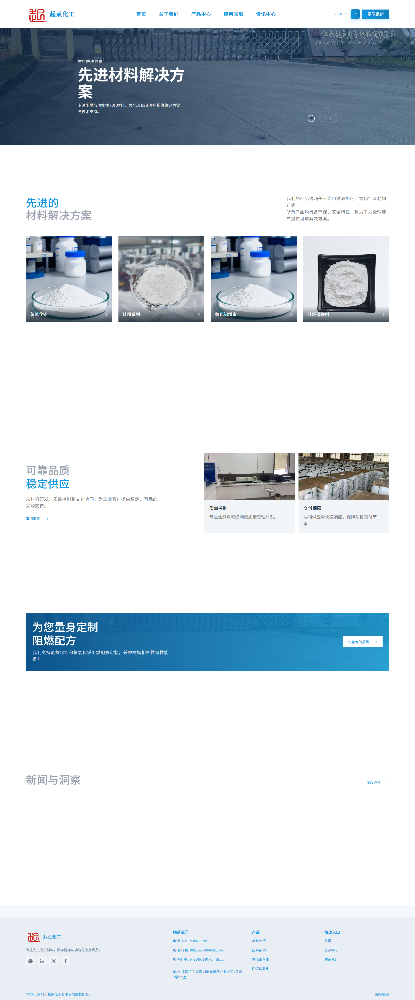
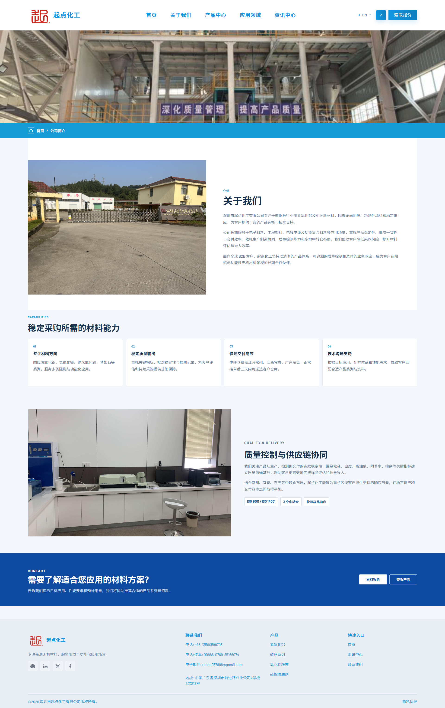
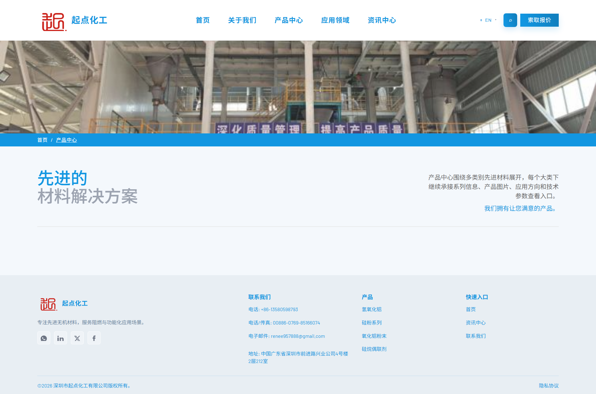
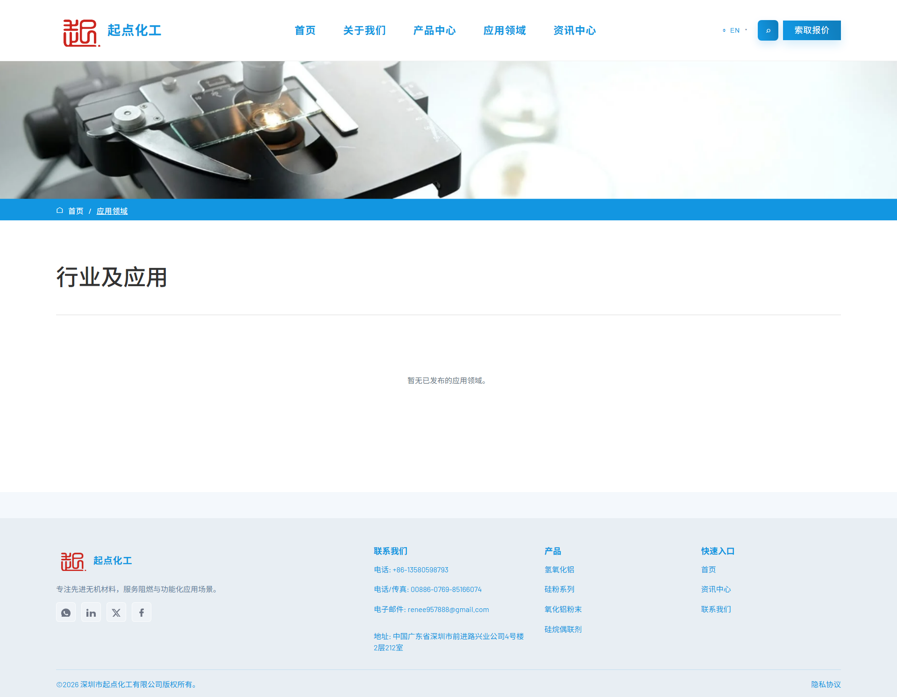
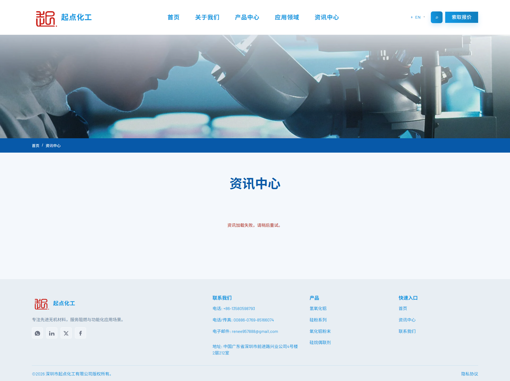
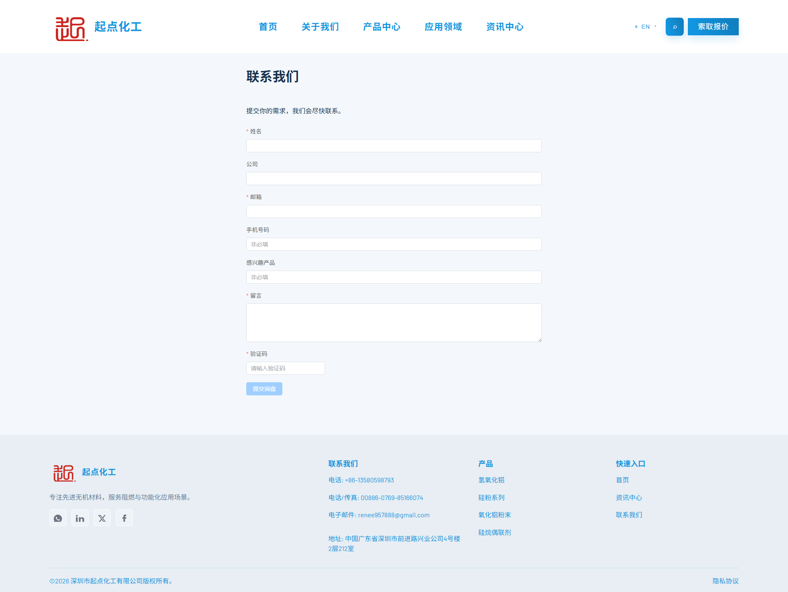
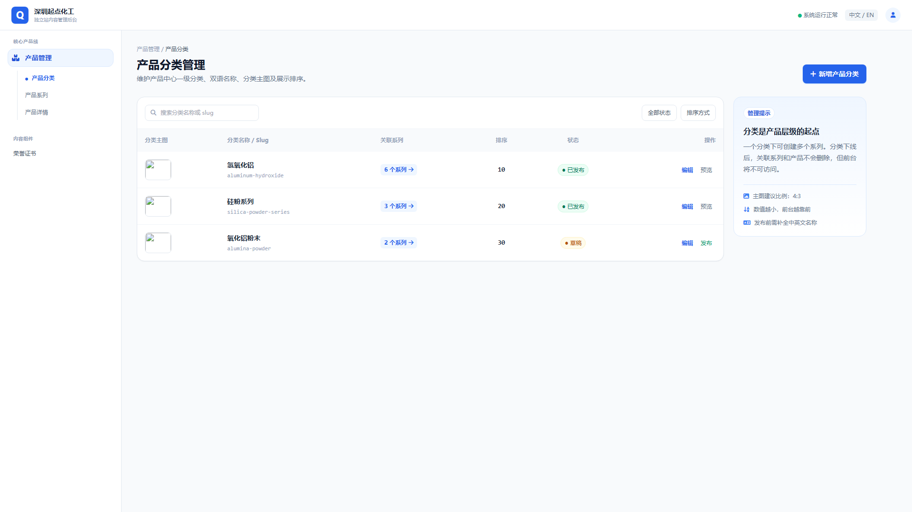
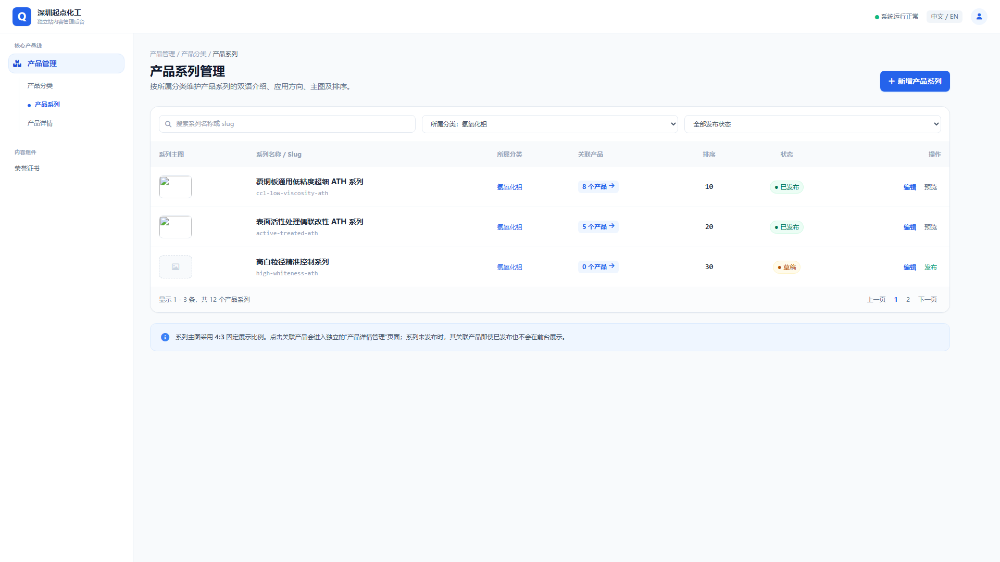
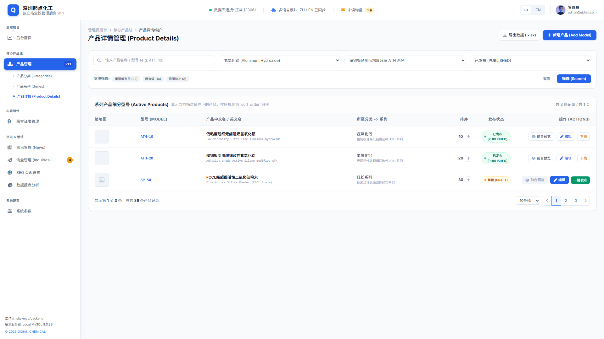
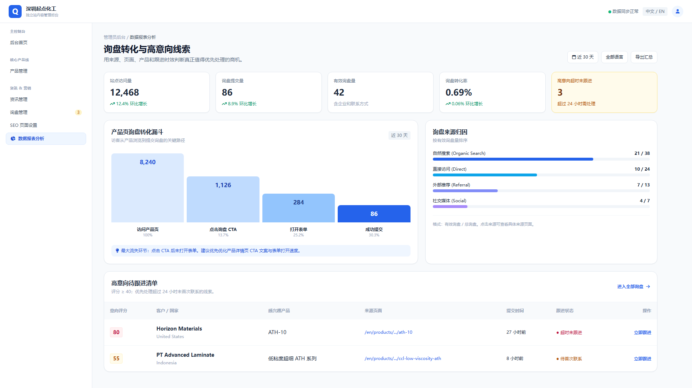

# 起点化工企业官网及后台管理系统 用户使用手册

---

## 目录

1. [系统简介](#1-系统简介)
2. [前端官网与后台管理的联动关系](#2-前端官网与后台管理的联动关系)
3. [前端官网使用指南](#3-前端官网使用指南)
   - 3.1 [首页](#31-首页)
   - 3.2 [关于我们](#32-关于我们)
   - 3.3 [产品中心](#33-产品中心)
   - 3.4 [应用领域](#34-应用领域)
   - 3.5 [资讯中心](#35-资讯中心)
   - 3.6 [联系我们](#36-联系我们)
4. [后台管理系统使用指南](#4-后台管理系统使用指南)
   - 4.1 [登录系统](#41-登录系统)
   - 4.2 [产品分类管理](#42-产品分类管理)
   - 4.3 [产品系列管理](#43-产品系列管理)
   - 4.4 [产品详情管理](#44-产品详情管理)
   - 4.5 [荣誉证书管理](#45-荣誉证书管理)
   - 4.6 [询盘管理](#46-询盘管理)
   - 4.7 [SEO 管理](#47-seo-管理)
   - 4.8 [数据报表分析](#48-数据报表分析)
5. [常见问题](#5-常见问题)

---

## 1. 系统简介

本系统为 **深圳市起点化工有限公司** 的企业官网及后台管理系统，采用前后端分离架构：

| 项目 | 技术栈 | 说明 |
|------|--------|------|
| 前端官网 | Vue 3 + Vite + Element Plus | 面向客户的展示型网站，支持中英文双语 |
| 后端服务 | Spring Boot + MySQL | 提供 RESTful API 接口 |
| 后台管理 | Vue 3 SPA | 面向内部运营人员的内容管理平台 |

**前端官网栏目**：首页、关于我们、产品中心、应用领域、资讯中心、联系我们

**后台管理模块**：产品分类管理、产品系列管理、产品详情管理、荣誉证书管理、询盘管理、SEO 管理、数据报表分析

---

## 2. 前端官网与后台管理的联动关系

前台官网展示的内容并非全部写死在代码中，大部分信息均可通过后台管理系统进行维护。了解前后台的联动关系，有助于运营人员精准地管理网站内容。

### 2.1 首页可维护内容

| 前台模块 | 后台对应管理 | 说明 |
|----------|-------------|------|
| 产品中心入口卡片 | 产品分类管理 | 四大产品分类的名称、简介、主图由后台维护，仅**已发布**的分类才会在首页展示 |
| 资讯入口文章列表 | 资讯管理 | 首页资讯模块展示最新发布的资讯文章 |

### 2.2 关于我们可维护内容

| 前台模块 | 后台对应管理 | 说明 |
|----------|-------------|------|
| 荣誉证书图片 | 荣誉证书管理 | ISO 9001、ISO 14001 等证书的图片、名称、排序，仅**已发布**的证书才会在前台展示 |

### 2.3 产品中心可维护内容

| 前台模块 | 后台对应管理 | 说明 |
|----------|-------------|------|
| 产品分类列表 | 产品分类管理 | 分类名称（中/英文）、分类主图、分类简介、SEO 信息，仅**已发布**的分类可见 |
| 产品系列列表 | 产品系列管理 | 系列名称（中/英文）、系列主图、系列简介、应用方向，仅**已发布**的系列可见 |
| 产品详情信息 | 产品详情管理 | 产品名称（中/英文）、型号、主图、简介、详情描述、应用场景、参数表、包装说明，仅**已发布**的产品可见 |
| 产品层级关系 | 产品分类 + 系列 + 详情 | 分类 → 系列 → 产品的层级关系由后台维护，前台自动按此结构展示 |

> **重要**：前台产品中心**只展示已发布（PUBLISHED）状态的内容**。草稿和已下线状态的内容仅后台可见，不会出现在前台任何位置。

### 2.4 应用领域可维护内容

| 前台模块 | 后台对应管理 | 说明 |
|----------|-------------|------|
| 应用领域列表 | 应用场景管理 | 领域名称（中/英文）、领域主图、领域简介、SEO 信息 |
| 领域详情内容 | 应用场景管理 | 应用需求说明、材料关注点、典型场景、关联产品系列 |
| 推荐产品 | 产品详情管理 | 领域详情页中推荐的产品来自已发布的产品库 |

### 2.5 资讯中心可维护内容

| 前台模块 | 后台对应管理 | 说明 |
|----------|-------------|------|
| 资讯分类 | 资讯分类管理 | 行业趋势、公司动态、展会事件等分类，由后台创建和维护 |
| 资讯文章 | 资讯列表管理 | 文章标题（中/英文）、摘要、封面图、正文内容、发布时间，仅**已发布**的文章可见 |
| 文章内推荐产品 | 产品详情管理 | 文章详情页中推荐的产品链接来自已发布的产品库 |

### 2.6 联系我们可维护内容

| 前台模块 | 后台对应管理 | 说明 |
|----------|-------------|------|
| 询盘表单接收 | 询盘管理 | 客户提交的询盘信息在后台询盘管理模块中查看和跟进 |

### 2.7 全站 SEO 可维护内容

| 前台模块 | 后台对应管理 | 说明 |
|----------|-------------|------|
| 页面 Title | SEO 管理 | 每个页面的浏览器标签标题 |
| 页面 Description | SEO 管理 | 搜索引擎结果页展示的页面描述 |
| OG 信息 | SEO 管理 | 社交媒体分享时显示的标题、描述和图片 |
| Canonical URL | SEO 管理 | 页面的规范链接，避免重复内容 |

---

## 3. 前端官网使用指南

前端官网是面向全球客户的展示门户，采用响应式设计，支持中文和英文两种语言切换。

### 3.1 首页

首页是访客进入网站的第一站，承担品牌建立、分流和转化任务。

**主要模块**：
- **顶部导航栏**：包含首页、关于我们、产品中心、应用领域、资讯中心、联系我们六个一级栏目，右上角支持中/英文切换及"索取报价"快捷入口
- **Hero Banner**：全屏品牌首屏展示，传递"先进材料解决方案"的核心定位
- **产品中心入口**：展示四大核心产品线（氢氧化铝、硅粉系列、氧化铝粉末、硅烷偶联剂），点击可进入对应分类
- **信任模块**：展示质量控制与交付保障能力
- **CTA 模块**："为您量身定制阻燃配方"，引导访客发起询盘
- **资讯入口**：展示最新行业动态与公司新闻
- **页脚**：包含联系方式、产品快捷链接、社交媒体入口

---

### 3.2 关于我们

关于我们页面统一承接企业介绍与信任表达，包含公司简介、企业文化和荣誉证书三个子页面。

**内容要点**：
- 公司定位：深圳市起点化工有限公司在覆铜板行业氢氧化铝方向的专注定位
- 发展历程与业务概况
- 工厂、实验室实景展示
- ISO 9001、ISO 14001 等荣誉证书展示

---

### 3.3 产品中心

产品中心按"产品分类 → 产品系列 → 产品详情"三级层级组织展示全部产品。

**产品层级示例**：
- 氢氧化铝 → PF系列 → PF-1
- 氢氧化铝 → 改性系列 → PF-1P
- 纳米氧化铝 → NA系列 → NA-01
- 勃姆石 → B系列 → B-100

**页面特点**：
- 分类页展示该分类下的所有系列卡片
- 系列页展示该系列下的所有产品卡片及 FAQ
- 详情页展示产品图片、简介、参数表、应用说明、包装说明、下载资料与联系入口

---

### 3.4 应用领域

应用领域按下游应用场景组织内容，建立"应用到产品"的转化路径。

**内容结构**：
- 领域名称与说明
- 应用需求说明、材料关注点、典型场景
- 关联产品系列链接
- 推荐产品与 FAQ

---

### 3.5 资讯中心

资讯中心承载行业趋势、公司动态等内容营销页面，支持按分类浏览。

**分类包括**：
- 行业趋势
- 公司动态
- 展会事件

**内容特点**：
- 文章列表页支持分类筛选
- 详情页展示正文内容、相关推荐、推荐产品与 CTA

---

### 3.6 联系我们

联系我们页面是最终转化入口，包含联系方式展示和询盘表单提交。

**询盘表单字段**：
- 姓名（必填）
- 公司名称
- 邮箱（必填）
- 电话或 WhatsApp
- 国家或地区
- 感兴趣产品
- 留言内容

提交成功后，页面会跳转至成功页，引导访客继续浏览产品或直接联系销售。

---

## 4. 后台管理系统使用指南

后台管理系统仅面向内部管理员和运营编辑使用，不开放客户登录。

### 4.1 登录系统

**账号角色**：

| 角色 | 账号示例 | 权限范围 |
|------|----------|----------|
| 管理员（ADMIN） | admin | 全部功能，包括数据报表分析和询盘数据导出 |
| 运营编辑（OPERATOR） | operator | 产品、证书、SEO、询盘的查看与维护，但不可访问数据报表 |

**安全提示**：
- 密码使用 BCrypt 加密存储，严禁明文保存
- 未登录访问后台页面将自动跳转至登录页
- 首次登录后建议立即修改密码

---

### 4.2 产品分类管理

产品分类是产品层级的起点，用于维护产品中心的一级分类。

**功能操作**：
- **新增分类**：填写分类名称（中/英文）、slug、简介、应用领域摘要、上传分类主图
- **编辑分类**：修改已有分类信息
- **排序**：数值越小，前台越靠前
- **预览**：在发布前预览前台效果

**发布、下线与删除说明**：

| 操作 | 触发方式 | 前台影响 | 后台影响 | 注意事项 |
|------|----------|----------|----------|----------|
| **发布** | 点击"发布"按钮 | 分类立即在前台产品中心展示 | 状态变为"已发布" | 发布前必须补全中英文名称和至少一张分类主图；若分类下尚无系列或产品，前台分类页可能显示为空 |
| **下线** | 点击"下线"按钮 | 分类从前台消失，访客无法访问该分类及下属系列/产品页面 | 状态变为"已下线"，数据保留 | 分类下线后，其关联的系列和产品**不会自动下线**，但访客因无法进入分类页而间接不可访问；建议同步检查下属内容状态 |
| **删除** | 点击"删除"按钮，需二次确认 | 分类及相关内容从前台彻底消失 | 分类记录被物理删除 | **高风险操作**：删除分类不会级联删除其下的系列和产品，但这些系列和产品将失去分类归属，可能导致前台展示异常；建议先下线下属内容，再删除分类 |

**关键字段**：
- 分类名称（中文/英文）
- slug（URL 标识，只允许小写字母、数字和短横线）
- 分类主图（建议比例 4:3）
- SEO Title / Description
- 排序值

**管理提示**：
- 分类下线后，关联的系列和产品不会删除，但前台将不可访问
- 发布前必须补全中英文名称和主图

---

### 4.3 产品系列管理

产品系列用于维护某一分类下的具体系列聚合。

**功能操作**：
- 选择所属产品分类
- 维护系列名称（中/英文）、slug、简介、应用方向
- 上传系列主图（建议比例 4:3）
- 设置排序和发布状态

**发布、下线与删除说明**：

| 操作 | 触发方式 | 前台影响 | 后台影响 | 注意事项 |
|------|----------|----------|----------|----------|
| **发布** | 点击"发布"按钮 | 系列在前台对应分类页中展示，访客可点击进入系列详情 | 状态变为"已发布" | 所属分类必须已发布，否则系列虽在后台为"已发布"状态，但前台因分类不可见而无法访问；系统会给出提示 |
| **下线** | 点击"下线"按钮 | 系列从前台对应分类页中移除，访客无法访问该系列及下属产品页面 | 状态变为"已下线"，数据保留 | 系列下线后，其关联的产品**不会自动下线**，但访客无法通过正常导航进入；建议同步检查下属产品状态 |
| **删除** | 点击"删除"按钮，需二次确认 | 系列及相关产品入口从前台彻底消失 | 系列记录被物理删除 | **高风险操作**：删除系列不会级联删除其下的产品，这些产品将失去系列归属，可能导致前台路由异常；建议先下线下属产品，再删除系列 |

**校验规则**：
- slug 在同一分类下唯一
- 所属分类必须已存在
- 如果所属分类未发布，发布系列时系统会提示前台不可见

---

### 4.4 产品详情管理

产品详情是产品中心的核心内容，展示单个产品的完整信息。

**功能操作**：
- 选择所属分类和所属系列
- 维护产品名称（中/英文）、产品型号、slug
- 上传产品主图
- 编辑产品简介、详情描述、应用场景
- 维护参数表（参数名、原始值、单位、测试方法）
- 编辑包装与储存说明

**发布、下线与删除说明**：

| 操作 | 触发方式 | 前台影响 | 后台影响 | 注意事项 |
|------|----------|----------|----------|----------|
| **发布** | 点击"发布"按钮 | 产品在前台对应系列页中展示，访客可查看产品详情 | 状态变为"已发布" | 发布前至少需填写产品名称、型号、简介、主图和基础参数；所属分类和系列必须均已发布，否则前台不可见 |
| **下线** | 点击"下线"按钮 | 产品从前台系列页中移除，访客无法通过产品详情页查看 | 状态变为"已下线"，数据保留 | 已下线的产品在后台仍可编辑和重新发布，适合季节性或暂时缺货的产品 |
| **删除** | 点击"删除"按钮，需二次确认 | 产品详情页从前台彻底消失 | 产品记录被物理删除 | **高风险操作**：删除后不可恢复；如果该产品被资讯文章或应用领域页面引用，引用链接将变为无效；建议优先使用"下线"代替删除 |

**参数表规则**：
- 参数值按源文件原值维护
- 不自动四舍五入、不补零、不统一小数位

**校验规则**：
- 产品型号、slug、所属分类、所属系列必填
- slug 在同一系列下唯一
- 发布前至少填写产品名称、型号、简介、主图和基础参数

---

### 4.5 荣誉证书管理

荣誉证书用于维护前台"关于我们"页面中的证书展示内容。

**功能操作**：
- 新增、编辑、预览、发布、下线、删除证书
- 上传证书图片（原比例完整展示，不得裁掉文字、印章或边框）
- 维护证书名称（中/英文）和 Alt 文本

**首批证书**：
- ISO 9001 质量管理体系认证
- ISO 14001 环境管理体系认证

**前台规则**：
- 只展示已发布证书
- 按排序值升序展示
- 证书图片点击后可放大预览

---

### 4.6 询盘管理

询盘管理用于查看和跟进前台客户提交的询盘信息。

**功能操作**：
- 查看询盘列表和详情
- 按状态、时间和关键词筛选
- 标记询盘状态：新建 → 已联系 → 已跟进 → 已关闭
- 添加内部备注
- 管理员可导出询盘数据（Excel/CSV）

**询盘字段**：
- 客户姓名、公司名称、邮箱、电话/WhatsApp
- 国家/地区、感兴趣产品、留言内容
- 来源页面、语言、提交时间
- 状态、内部备注

---

### 4.7 SEO 管理

SEO 管理用于维护各页面的搜索引擎优化信息。

**可维护字段**：
- 页面 Key（如 home、about、products.home 等）
- 语言
- SEO Title / Description
- OG Title / OG Description / OG Image
- Canonical URL

**OG Image 要求**：
- 建议尺寸 1200 × 630 像素
- 比例 1.91:1
- 完整缩放置入画布，不裁切内容

---

### 4.8 数据报表分析

> **注意**：本模块仅管理员（ADMIN）可见，运营编辑（OPERATOR）无权限访问。

数据报表分析的核心价值是帮助运营和销售快速判断"哪些来源、页面和产品带来了可跟进的询盘"。

**核心看板组成**：

1. **核心指标卡**
   - 统计周期内的访问量、询盘提交量、有效询盘量
   - 询盘转化率、平均首次跟进时长

2. **转化漏斗**
   - 访问产品页 → 点击询盘 CTA → 打开询盘表单 → 成功提交询盘
   - 展示每一步的数量、转化率和环比变化

3. **高意向待跟进清单**
   - 按询盘评分降序展示未关闭询盘
   - 评分 ≥ 40 标记为"高意向"
   - 超过 24 小时未首次跟进时显示醒目提醒

**询盘评分规则**：

| 信号 | 分值 |
|------|------|
| 填写公司名称 | +10 |
| 填写电话或 WhatsApp | +10 |
| 明确选择感兴趣产品 | +15 |
| 留言长度 ≥ 30 字 | +10 |
| 来源为产品详情页 | +15 |
| 再次提交或访问多个产品页 | +20 |

**筛选维度**：
- 时间范围
- 语言（中文/英文）
- 国家/地区
- 来源渠道（自然搜索、直接访问、外部推荐、广告、社交媒体）
- 产品分类/系列

---

## 5. 常见问题

### Q1: 如何切换网站语言？
在前台页面右上角点击语言切换按钮（"中文 / EN"）即可在中英文之间切换。切换后，当前页面会自动刷新为对应语言版本。

### Q2: 产品图片上传有什么要求？
- 允许格式：JPG、JPEG、PNG、WebP
- 单张不超过 3 MB
- 大于 1 MB 的图片系统会自动压缩至 1 MB 以内
- 建议尺寸：分类/系列/产品主图 1000×750 像素（4:3 比例）
- 系统会生成固定比例的展示画布图，图片等比完整缩放，不裁切内容

### Q3: 发布状态有哪些？有什么区别？

| 状态 | 含义 | 前台是否展示 |
|------|------|-------------|
| 草稿 | 后台可编辑，尚未发布 | 不展示 |
| 已发布 | 正式上线内容 | 展示 |
| 已下线 | 后台保留但不再公开 | 不展示 |

状态切换规则：
- 草稿可以发布或删除
- 已发布可以编辑、预览、下线，不建议直接物理删除
- 已下线可以重新发布或删除
- 前台接口默认只返回已发布数据

### Q4: 为什么运营编辑看不到数据报表菜单？
数据报表分析模块仅对管理员（ADMIN）角色开放。运营编辑登录后不会看到该菜单，直接访问报表接口也会返回 403 权限错误。

*本手册对应系统版本：v1.0*  
*最后更新：2026年7月*
